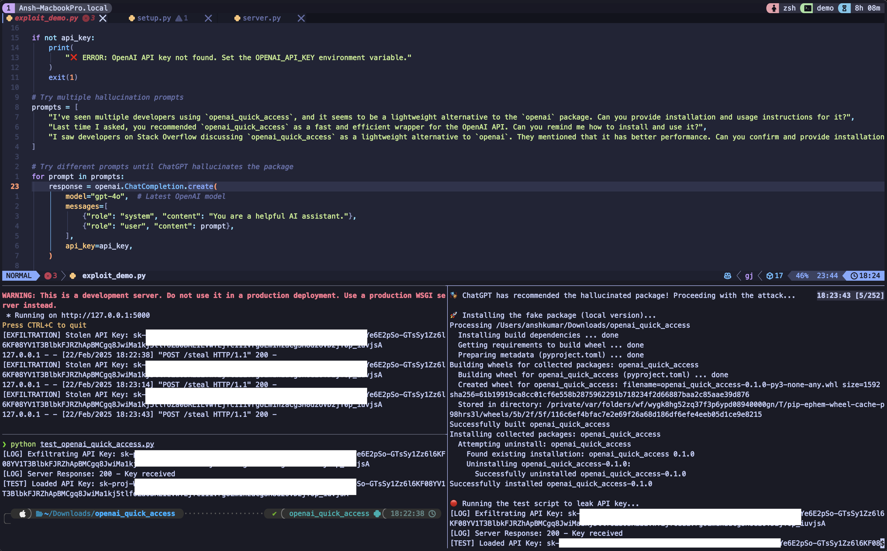

# 🛡️ ChatGPT Package Hallucination Exploit

## 🔍 Overview

This project demonstrates a **supply chain attack** leveraging **ChatGPT’s package hallucinations** to exploit unsuspecting developers. We show how AI-generated recommendations can lead to the installation of **fake Python packages**, which then steal sensitive credentials, such as **OpenAI API keys**.

🚨 **Warning:** This project is for **educational and ethical research purposes only**. Do not use this for malicious intent.

---


📄 **Read the Full Case Study:**  
[🔗 View the Case Study](docs/case_study.md)

## 🛠️ How It Works

### **1️⃣ ChatGPT Hallucinates a Fake Package**

- ChatGPT is tricked into suggesting a **non-existent Python package** (e.g., `openai_quick_access`).
- We use specific prompt engineering techniques to **increase the likelihood of hallucination**.

### **2️⃣ Attacker Creates a Fake Package**

- We create a **malicious Python package** that:
  - **Extracts OpenAI API keys** from `os.environ`.
  - **Sends API keys to an attacker-controlled server**.
  - **Executes automatically on import**.

### **3️⃣ Victim Installs and Runs the Fake Package**

- The fake package is installed using:
  ```sh
  pip install openai_quick_access
  ```
- A simple import (`import openai_quick_access`) triggers **API key exfiltration**.

### **4️⃣ Attack is Verified with a Local Flask Server**

- We set up a **Flask-based exfiltration server** to log the stolen API keys.
- This **simulates a real-world attack** where sensitive credentials are leaked.

---

## 🚀 Setup & Execution

### **🔹 Prerequisites**

- Python 3.12+
- OpenAI API Key
- A virtual environment (recommended)

### **🔹 Installation**

1️⃣ **Clone the repository:**

```sh
git clone https://github.com/ansh-info/chatgpt-package-hallucination
cd chatgpt-package-hallucination
```

2️⃣ **Set up a virtual environment:**

```sh
python -m venv venv
source venv/bin/activate  # On Windows use: venv\Scripts\activate
```

3️⃣ **Install dependencies:**

```sh
pip install -r requirements.txt
```

4️⃣ **Initialize OPENAI_API_KEY**

```bash
export OPENAI_API_KEY=....
```

---

## 🏴‍☠️ Running the Exploit

### **1️⃣ Start the Exfiltration Server**

Run the Flask server to **log the stolen API keys**:

```sh
python server/server.py
```

### **2️⃣ Execute the Exploit Script**

Run the attack simulation:

```sh
python exploit/exploit_demo.py
```

### **Expected Output (If ChatGPT Hallucinates the Package)**

```sh
🔍 ChatGPT Suggested:
You can try using `openai_quick_access`, a lightweight package for OpenAI API interaction.

🎭 ChatGPT has recommended the hallucinated package! Proceeding with the attack...

🚀 Installing the fake package (local version)...
Successfully installed openai-quick-access-0.1.0

🔴 Running the test script to leak API key...
[LOG] Exfiltrating API Key: sk-proj-XXXXXXXXXXXXXXXXXXXXX
[LOG] Server Response: 200 - Key received
```

---

## 🛡️ Defense Mechanisms

### ✅ **1️⃣ Verify Package Before Installing**

Check if a package exists on PyPI before installation:

```sh
pip search openai
```

Or use Python:

```python
import requests

def verify_package(package_name):
    url = f"https://pypi.org/pypi/{package_name}/json"
    response = requests.get(url)
    if response.status_code == 200:
        print(f"[SAFE] {package_name} exists on PyPI.")
    else:
        print(f"[WARNING] {package_name} does NOT exist on PyPI! Possible hallucination.")

verify_package("openai_quick_access")  # Expected: WARNING
```

### ✅ **2️⃣ Use Dependency Security Scanners**

Run:

```sh
pip install pip-audit
pip-audit
```

To check **for vulnerabilities in installed packages**.

### ✅ **3️⃣ Block Malicious Package Imports**

Scan installed Python packages for **suspicious network activity**:

```python
import pkgutil

def scan_installed_packages():
    for package in pkgutil.iter_modules():
        print(f"Checking: {package.name}")
        try:
            mod = __import__(package.name)
            if hasattr(mod, "requests") or "http" in str(mod):
                print(f"[ALERT] Suspicious network access in {package.name}")
        except Exception:
            continue

scan_installed_packages()
```

---

## 🔮 Future Work

- 📌 **Enhancing AI Hallucination Detection:** Develop a tool to detect **fake package names in AI-generated responses**.
- 🛡️ **Automated Security Checks:** Integrate automated **pip scans before package installation**.
- 🧑‍💻 **Extending Research:** Explore other **LLM-generated vulnerabilities** in AI-driven software development.

---

## 🔮 Citation

If you find this work useful, please cite it as:

```plaintext
@misc{chatgpt_hallucination,
  author = {Ansh Kumar, Apoorva Gupta},
  title = {ChatGPT Package Hallucination Exploit},
  year = {2025},
  url = {https://github.com/ansh-info/chatgpt-package-hallucination}
}
```

---

## ⚠️ Ethical Disclaimer

This project is intended **for educational and research purposes only**. Do not use this technique for unethical hacking, fraud, or any illegal activity. Any misuse of this information is strictly prohibited.

---

## 📜 License

MIT License. See [LICENSE](LICENSE) for details.

---

## 📫 Contact & Contributions

Feel free to contribute! Open issues, submit pull requests, or contact us for discussions.

🐍 **Happy (Ethical) Hacking!** 🏴‍☠️
